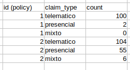
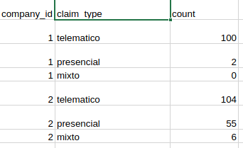

## SQL

Supongamos que tenemos el siguiente esquema de Base de Datos

* Pólizas
* status podrá ser activo o inactivo
* Siniestros
* claim_type podrá ser telemático, presencial o mixto
* Usuarios

Write SQL queries to extract the following information:

**1)** Número de pólizas activas

 

**2)** Todas las campañías activas. Una compañia está activa si al menos hay una poliza activa (company_id)

 

**3)** Número de compañías activas

 

**4)** Numero de siniestros por cada poliza desglosado por tipo de siniestro

 

**5)** Número de siniestros por compañía y por tipo de evento

 

**6)** ¿Cómo crearias la tabla para relacionar usuarios y polizas?

**7)** Número de polizas por usuario y por estado de la poliza teniendo en cuanta que puedes usar la tabla de la relación anterior
